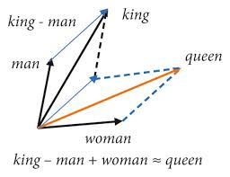

# Word2Vec-Galaxy

An interactive 3D visualization tool for high-dimensional word vectors and performing vector arithmetic operations. 

## References

- Mikolov, Tomas, et al. "Efficient estimation of word representations in vector space." arXiv preprint arXiv:1301.3781 (2013).
- Mikolov, Tomas, et al. "Distributed representations of words and phrases and their compositionality." Advances in neural information processing systems 26 (2013).
- [Gensim Word2Vec](https://radimrehurek.com/gensim/models/word2vec.html) - Word2Vec model

## Features

- **3D Word Vector Visualization** - Explore semantically similar words in interactive 3D space using PCA dimensionality reduction
- **Vector Arithmetic Operations** - Perform and visualize classic word analogies (king - man + woman = queen) with step-by-step vector operations
- **Interactive Controls** - Intuitive sidebar controls for customizing visualizations and selecting parameters

## Repository Structure

```
Word2Vec-Galaxy/
┣ .streamlit/
┃ ┗ config.toml
┣ main.py                         ← Streamlit frontend
┣ word_vectors.py                 ← Word2Vec model handler
┣ visualization.py                ← 3D plotting functions
┣ requirements.txt
┗ README.md
```

## Getting Started

Follow these steps to set up and run the Word2Vec Galaxy visualization tool locally.

### 1. Prerequisites

- **Python 3.10+** (Conda or Venv recommended)
- **4GB+ RAM** (for handling the Word2Vec model)

### 2. Clone the Repository

```bash
git clone https://github.com/Gayanukaa/Word2Vec-Galaxy.git
cd Word2Vec-Galaxy
```

### 3. Create & Activate Conda Environment

```bash
conda create -n word2vec python=3.11 -y
conda activate word2vec
```

### 4. Install Python Dependencies

```bash
pip install -r requirements.txt
```

## Running the Application

From the project root:

```bash
streamlit run main.py
```

The app will open in your browser (usually at `http://localhost:8501`).

### First Run Setup

- The application will automatically download the Google News Word2Vec model on first launch
- Subsequent runs will use the cached model for faster startup

## How to Use

### Similar Words Visualization

1. Enter a word in the sidebar (e.g., "pet", "computer", "happiness")
2. Adjust the number of similar words using the slider (5-50)
3. Click "🔍 Visualize Similar Words"
4. Explore the 3D plot where colors indicate semantic similarity

### Vector Arithmetic

1. Enter three words for the analogy:
   - **Word 1 (subtract)**: e.g., "man"
   - **Word 2 (add)**: e.g., "woman"
   - **Word 3 (base)**: e.g., "king"
2. Click "🔢 Calculate Analogy"
3. View the result (e.g., "queen") and explore the vector visualization.

### Example Analogies



- `king - man + woman = queen`
- `walking - walk + run = running`

## Technical Details

### Word Vector Model

- Uses Google's pre-trained Word2Vec model (300 dimensions)
- Vocabulary: ~3 million words and phrases
- Trained on Google News dataset (100 billion words)

### Dimensionality Reduction

- **PCA (Principal Component Analysis)** for reducing 300D vectors to 3D
- **PC1, PC2, PC3** represent the three principal components with highest variance

### Known Limitations & Solutions

**Input Word Echo Problem**: Word2Vec analogies sometimes return input words instead of true analogical matches. This occurs because:

- Input words have high similarity to the computed result vector
- The model may prefer familiar words over novel analogical relationships
- Example: `king - man + woman` might return "king" instead of "queen"

**Resolve**: The application automatically filters out all input words from analogy results, forcing the model to find genuine analogical relationships rather than echoing familiar terms.

### Common Issues

- **Threading errors**: Restart the application if model loading hangs
- **Path issues**: Ensure you're running from the project root directory
- **Conda environment**: Activate the correct environment before running

## License

This project is licensed under the [MIT License](https://choosealicense.com/licenses/mit/), allowing for open-source collaboration and modification.
